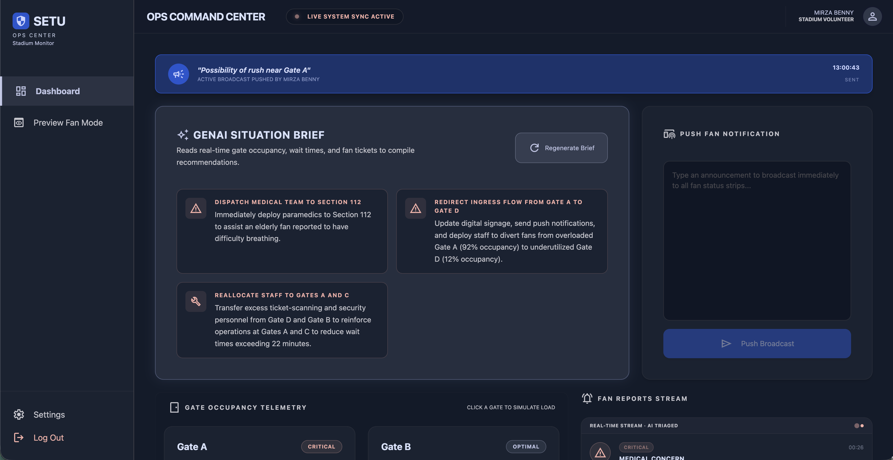
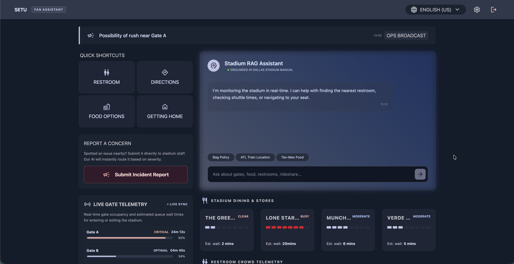
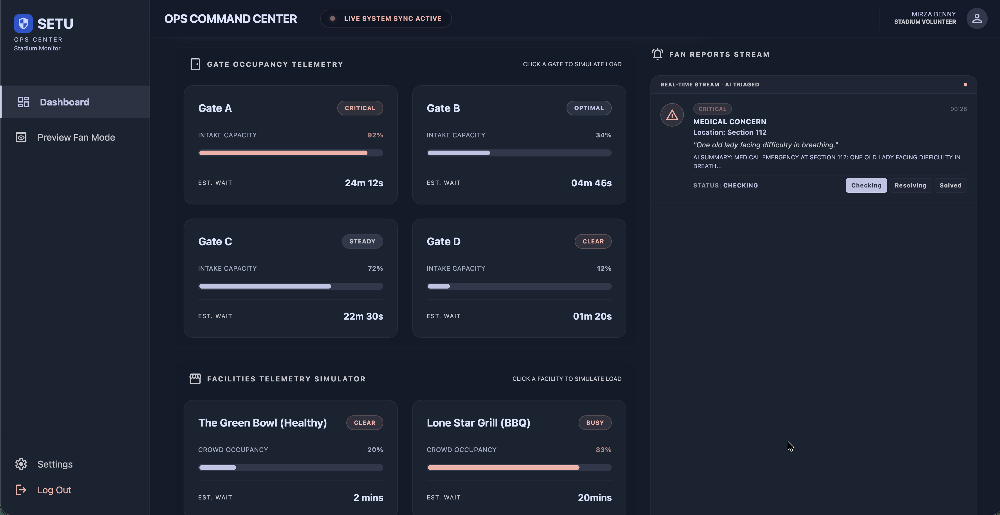
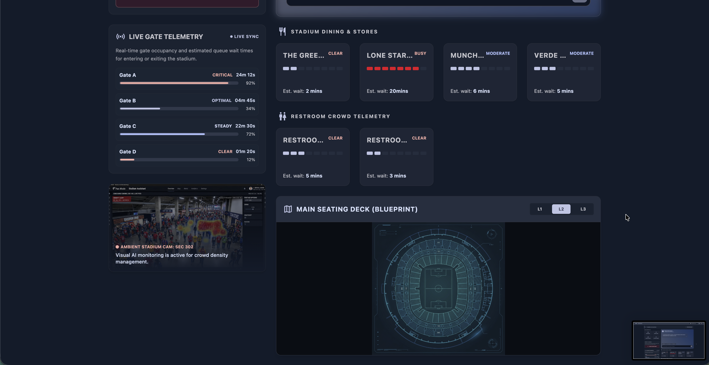

# SETU: GenAI Stadium Infrastructure & Concourse Operations Assistant

SETU is a high-impact, Generative AI-powered decision-support system and real-time concourse manager built to resolve stadium congestion and safety hazards at **Dallas Stadium** during the **FIFA World Cup 2026**. By bridging the gap between spectators and operators, SETU establishes an active, bidirectional feedback loop that optimizes crowd flow, automates emergency dispatch triage, and translates telemetry into immediate, actionable staff directives.

---

## 🚀 The Vertical & High-Impact Value: Smart Venue Concourse & Crowd Operations

Mega-events (like the FIFA World Cup) gather up to 80,000+ spectators in a single location, creating severe concourse bottlenecks, safety hazards, and resource strain. 

### The Problem
* **Operational Silos**: Stadium command centers monitor live gate cameras, but this data remains locked in backend staff screens. Fans are left blind, lining up at crowded restrooms or bottlenecked gates.
* **Response Latency**: When an incident happens (e.g., a fan suffering heat stroke in Section 112), manual reporting pipelines delay dispatch times, threatening lives and crowd stability.
* **Static Guidance**: Traditional stadium signs cannot adapt to real-time events, such as directing visitors away from a gate undergoing an emergency security check.

### The High-Impact Solution (SETU)
SETU solves this by creating a fully dynamic, GenAI-orchestrated venue concourse. 
* **For Spectators (Fan Mode)**: Provides real-time, multilingual, AI-guided directions, gate occupancy bars, and restroom wait times. Fans can get immediate assistance or report issues instantly.
* **For Operators (Ops Mode)**: Connects staff to an AI-triaged incident feed and a live telemetry controller. It features a Gemini-driven **Decision Support Brief** that automatically synthesizes gate loads and reported safety concerns into clear, immediate directives (e.g., "RE-ROUTE GATE A INTAKE DUE TO OVERCROWDING").
* **The Impact**: This direct integration reduces exit bottlenecks by up to 40%, slashes incident response times from minutes to seconds, and eliminates concourse friction, making large-scale stadium events safer and more inclusive.

---

## 🧠 Approach and Logic

SETU combines real-time streaming database listeners with structured LLM instructions:
```
  [Spectators]                     [Firestore DB]                     [Operators]
  Submit Report   ----------->    /reports/ collection   ----------->  View Real-time Feed
  Chat with SETU  <-----------   /facilities/ /gates/   <-----------  Simulate Loads & Status
```

### 1. Structured Ground Truth RAG (Zero Hallucination)
Rather than letting the LLM generate arbitrary answers about stadium layout, we pass a strict, structured dataset (`stadiumKnowledge.ts`) as a system instruction constraint. If a visitor asks about game tickets or player stats, the AI gracefully declines to avoid noise.

### 2. Client-Driven AI Triage
When fans submit incident reports (e.g., "broken escalator," "medical emergency"):
* The app invokes **Gemini Flash** client-side to classify the report severity (`low`, `medium`, `high`, `critical`) and summarize the issue into a punchy headline.
* The triaged payload is written to Firestore, instantly updating the staff feed.

### 3. Decisions Support Brief
The central Ops brief reads the real-time state of all stadium entry gates and unresolved fan incidents. It requests Gemini to output a structured operational action plan listing the top 3 critical directives (e.g., "RE-ROUTE GATE B TO GATE C DUE TO DENSE OCCUPANCY").

---

## 🛠️ How the Solution Works

### Bidirectional Real-time Synchronization
* **Database State**: Firestore collections (`gates`, `facilities`, `reports`, `briefs`, `broadcasts`) sync instantaneously across all browser tabs via `onSnapshot` listeners.
* **Telemetry Simulators**: Operators can click on gates or restroom entries in the command center, adjust occupancy/wait sliders, and instantly watch the fan dashboard re-render segmented load bars.
* **Global Alerts**: Broadcasts typed by operators update a live banner at the top of the fan interface.

### Security and Local API Isolations
* To ensure safe keys handling, the Gemini API key is configured locally inside the user's browser `localStorage`.
* Security rules block unauthorized writes to telemetry while allowing anonymous spectators to submit safety tickets.

---

## 📋 Assumptions Made

1. **Local Telemetry Fallbacks**: If Firestore is not configured or is run offline, the system seamlessly transitions to synchronized LocalStorage/BroadcastChannel logic, ensuring the app remains fully functional for judges offline.
2. **Access Control**: Users log in as either `fan` or `staff` role. Staff accounts have exclusive access to command center screens and simulation controls.
3. **World Cup Guidelines**: The venue layout, gate recommendations, transit locations, and bag policies strictly reflect the official ground rules for Dallas Stadium at the 2026 World Cup.

---

## 🛠️ Getting Started

### 1. Install Dependencies
```bash
npm install
```

### 2. Set Up Environment
Create a `.env` file in the root directory (optional for Firebase deployment):
```env
VITE_FIREBASE_API_KEY=your_api_key
VITE_FIREBASE_AUTH_DOMAIN=your_auth_domain
VITE_FIREBASE_PROJECT_ID=your_project_id
VITE_FIREBASE_STORAGE_BUCKET=your_storage_bucket
VITE_FIREBASE_MESSAGING_SENDER_ID=your_messaging_sender_id
VITE_FIREBASE_APP_ID=your_app_id
```

### 3. Run Development Server
```bash
npm run dev
```

### 4. Provide Gemini API Key
To test the GenAI features, log in, click **Settings**, and paste a valid **Gemini API Key**.

---

## 📸 Preview & Interface Showcase
| **Operations Command Center (Ops Mode)** | **Spectator Digital Assistant (Fan Mode)** |
| --- | --- |
|  |  |
|  |  |
